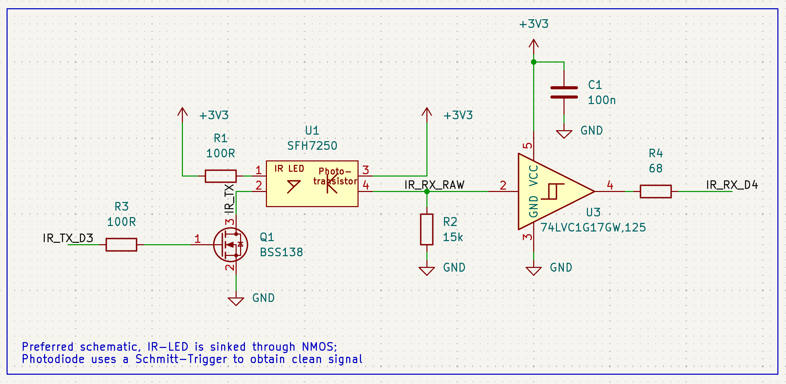
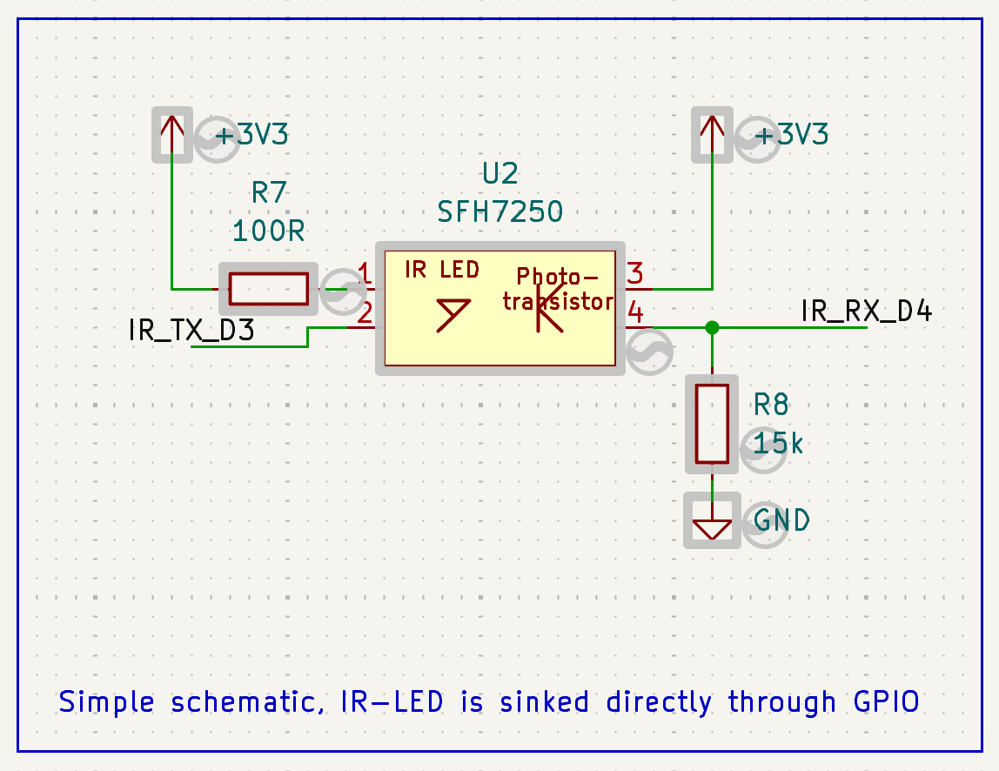

# FreeMDU Home

The ESP firmware offers a USB optical bridge and a standalone MQTT gateway for Home Assistant. It supports ESP32-C3 and ESP32-C6; the pin table below is for the XIAO ESP32-C3.

## Hardware and optical ports

Use an IR emitter and phototransistor appropriate for Miele's optical interface, such as the SFH 7250. Each port has its own UART and transceiver. Set the GPIO assignments for your board in `.cargo/local.toml`.

| Port | UART | TX | RX | GPIO TX/RX on XIAO ESP32-C3 |
| --- | --- | --- | --- | --- |
| IR | UART1 | D3 | D4 | 5 / 6 |
| IR2 | UART0 | D6 | D7 | 21 / 20 |

### Optical circuit variants

The preferred circuit drives the IR LED through an N-channel MOSFET and conditions the phototransistor signal with a Schmitt trigger:



The minimal circuit sinks the LED current directly through the TX GPIO and connects the phototransistor receiver without a Schmitt trigger:



Both variants apply to either optical port. The default `OPTICAL_TX_INVERTED`, `OPTICAL_RX_INVERTED`, `OPTICAL2_TX_INVERTED` and `OPTICAL2_RX_INVERTED` are all `"true"`, matching original FreeMDU. Set the TX inversion of a direct GPIO current-sink LED to `"false"`; it idles high with the LED off. Configure each port according to its actual circuit. The tested phototransistor/Schmitt receiver uses RX inversion `"true"` and passed local 2400-baud echo tests with a 10–15 kΩ pulldown. For the circuit without a Schmitt trigger, check the GPIO high level and run the echo tests on the assembled hardware; its reliability has not been established by those Schmitt-receiver tests.

The status LED uses GPIO10 by default. The LIS2DH is disabled by default. Set `ACCEL_ENABLED = "true"` only when fitted, and set `PIN_ACCEL_SDA`/`PIN_ACCEL_SCL` if the default D1/D2 (GPIO3/4) pins differ. Do not share them with an IR port. The XIAO ESP32-C6 has a different GPIO map.

## Device detection and MQTT

The two ports poll independently. The protocol library queries each appliance's software ID, selects a compatible implementation, and reads its [`DeviceKind`](../protocol/src/device.rs). A washing-machine profile publishes to `washer/...`; a tumble-dryer profile publishes to `dryer/...`, regardless of port. The same detected kind selects availability and the MQTT action route. Before executing an action the firmware reconnects and checks the *actual software ID* against the ID detected on that port. Unknown IDs and other device kinds receive no washer/dryer MQTT entities.

The current MQTT namespace supports **one washer and one dryer**. Two devices of the same kind would use the same topics and entity IDs; use a separate gateway or extend the namespace before connecting that pair. The protocol library and TUI support additional kinds, such as dishwashers, without standalone MQTT channels.

The ID410 read-only RAM trace runs only for software ID 410, on either port. The ID498 snapshot optimization and five-second polling run only for software ID 498. Other supported washers and dryers use their profile's normal `Operation` properties at `DEVICE_PUBLISH_INTERVAL` (default 60 seconds). These device-specific features do not imply equivalent addresses or semantics on another software ID.

In standalone mode, Home Assistant MQTT discovery registers the properties and actions reported by the selected device implementation. Operation properties are published under:

```text
freemdu_home/<ESP_ADDRESS>/<washer|dryer>/<PROPERTY>/value
```

An action uses `freemdu_home/<ESP_ADDRESS>/<washer|dryer>/<ACTION>/trigger`. An action with parameters accepts the MQTT payload as its argument; only parameterless actions receive HA buttons. Each channel has its own `washer/status` or `dryer/status` availability topic alongside the gateway `status`. Old single-port discovery entries may need removing once after migration.

## Firmware modes

- **Standalone:** polls both ports, publishes MQTT/HA entities, and offers diagnostic and OTA services. The USB and TCP diagnostic consoles, remote bridge and autonomous key scan use IR/UART1; the three local optical tests accept either port.
- **Bridge:** forwards USB serial data through IR/UART1 for desktop tools such as the [FreeMDU TUI](../tui/README.md).

## Build and flash

Install the Rust toolchain, target and [`espflash`](https://github.com/esp-rs/espflash). From `home/`, copy `.cargo/local.example.toml` to the ignored `.cargo/local.toml`, then set Wi-Fi and MQTT credentials, OTA token, GPIOs and optical polarity as needed. Tracked defaults are in [`.cargo/config.toml`](.cargo/config.toml); use `./cargo-local` so local settings are applied.

```sh
./cargo-local run --features esp32c3 --target riscv32imc-unknown-none-elf --release --bin standalone
```

The configured runner flashes over USB and opens the serial monitor. For ESP32-C6, use feature `esp32c6`, target `riscv32imac-unknown-none-elf`, and its actual GPIO numbers. For a USB bridge, select `--bin bridge`.

## Optical diagnostics

Disconnect the appliance for local echo tests. Enter commands in the USB serial console and submit with Ctrl-J:

```text
diag ir-test IR
diag baud-sweep IR2
diag burst-test IR
```

All three commands accept `IR` or `IR2`. `ir-test` illuminates the selected LED for about 4.7 seconds; measure the phototransistor/Schmitt input and output during `SEROPT ... ON`. `baud-sweep` sends single bytes (`55`, `11`, `00`) from 100 to 19200 baud, stopping at the first failure, then restores 2400-8E1. `burst-test` sends the four-byte request `11 00 00 02` continuously 100 times at 2400-8E1 and checks each echo byte. It stops after five failed trials and reports `ok=N fail=M`. A local echo pass does not verify appliance replies.

## Key scans and diagnostic reads

The authenticated `diag.py` and USB console use IR/UART1. A read-key scan runs on the ESP and persists its progress to flash, including across reboot. Do not swap appliances during an active scan: each handshake checks the stored software ID.

```sh
./diag.py HOST scan-start 0x0000 0xffff --timeout-ms 40 --max-timeout-ms 500
./diag.py HOST scan-status --watch 2
./diag.py HOST scan-pause
./diag.py HOST scan-resume
```

`find-read-key` aliases `scan-start`. Repeating the same settings resumes an existing job; change bounds or timeouts only after `scan-reset`, which discards progress. Polling and the remote optical bridge pause during scanning. An uncertain response increases the receive timeout and retries the same candidate; at the configured maximum the job pauses for inspection. The read scan does not write appliance memory. See [historical notes](HISTORY.md) for the journal/partition migration details.

### Full-access key scan (HALT)

Run this only with an idle appliance you can power-cycle. It sends HALT candidates but performs no RAM or EEPROM writes. An ACK is recorded as `halt_ack=1`, not as proof of write capability.

```sh
./diag.py HOST scan-reset
./diag.py HOST scan-full-start READ_KEY 0x0000 0xffff --timeout-ms 100
./diag.py HOST scan-status --watch 10
```

An interrupted or uncertain HALT attempt can leave `pending_key`; inspect/power-cycle the appliance before explicitly resuming. Normal MQTT and bridge activity remain suspended while such a test is pending. Keep recorded results before resetting. `mem16`, `eeprom1`, `eeprom16`, `dump-memory` and `dump-eeprom` accept `--full-key KEY` for explicitly requested reads after both read and full unlocks. These commands do not send HALT or write memory.

## Device-specific monitoring

For the T4223C (ID498), the read-only profile uses key `0x2b2c` and three 16-byte memory blocks per snapshot. It publishes selected program, door state, run marker, software ID and raw values every five seconds after detection. `0x55` means inactive, **not necessarily finished**; no completion event or remaining-time estimate is inferred. The receiver reports unknown markers as unknown. Do not apply its memory layout to other dryers. The W307 (ID410) has a separate read-only profile and optional RAM trace. [Historical notes](HISTORY.md#id498-monitoring-observations) retain the capture interpretation and validation details.

For a new T4223C capture, pause/reset any stored full-access scan, then run:

```sh
./diag.py HOST capture-id498 capture.jsonl --interval 5
```

The host must remain connected. The file records timestamps and raw blocks; `Ctrl+C` flushes it. Use a new output file for every capture.

## Verification

```sh
python3 -m unittest discover -s tests -v
cargo test --manifest-path scan-tests/Cargo.toml --target x86_64-unknown-linux-gnu
```

Use a native host target instead of `x86_64-unknown-linux-gnu` on other hosts.
